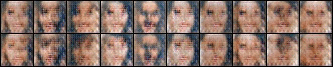

## VAE and GAN

In this homework, we implement VAE and GAN.

#### Example
```
$ sh hw4.sh <absolute path of hw4_data/> <output_path/>
```

#### Results
DCGAN:
<p align="center">
    
</p>

ACGAN:
<p align="center">
    
</p>
